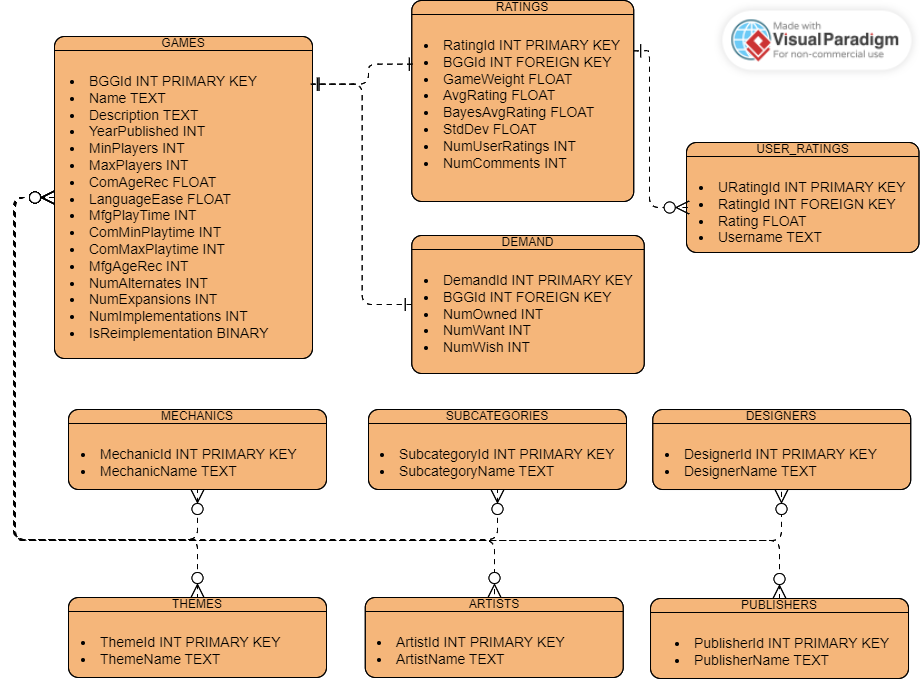

# DB Comparison

### Instruction

1. Download dataset from https://www.kaggle.com/datasets/threnjen/board-games-database-from-boardgamegeek
2. Move the .csv files to "source" directory
3. Run transform_data.py

